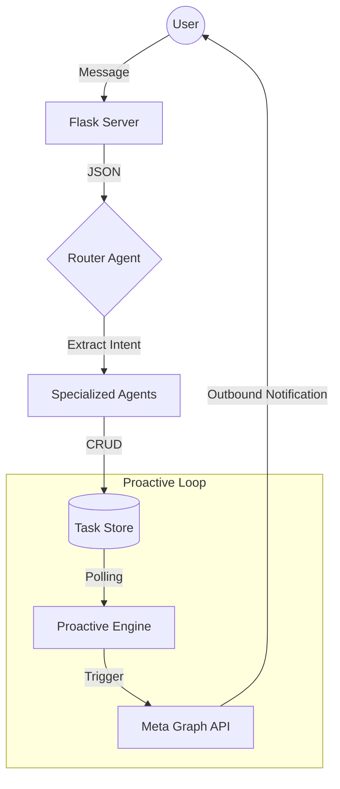

# 📱 WhatsApp AI Multi-Agent: Proactive Scheduler

**An enterprise-ready, agentic system that transforms WhatsApp into an autonomous personal assistant through proactive scheduling and multi-agent orchestration.**

[](https://www.python.org/)
[](https://python.langchain.com/)
[](https://openai.com/)
[](https://developers.facebook.com/docs/whatsapp)
[](https://opensource.org/licenses/MIT)

-----

## 🚀 The Core Innovation: Beyond Passive AI

Standard AI chatbots are **reactive**—they only function when a user initiates contact. This project solves the "Passive AI Bottleneck" by implementing a **Proactive Agent Layer**.

By monitoring a task database in the background, the system autonomously initiates outbound WhatsApp messages via the twilio API. It doesn't just remember your schedule; it **enforces** it.

### Key Value Propositions

  * **Autonomous Outbound:** Background workers trigger reminders without user prompts.
  * **Agentic Orchestration:** Uses a Router-Executor pattern to handle complex, multi-step scheduling.
  * **Stateful Persistence:** Maintains conversation context and scheduling state across multiple days.

-----

## 🏗️ System Architecture

The system is built on a decoupled, asynchronous architecture designed for scalability and reliability.

### 1\. The Ingestion & Routing Layer

Incoming WhatsApp messages are captured via a **Flask Webhook**. A **Router Agent** analyzes the JSON payload to classify intent:

  * **Type A (Scheduling):** Redirected to the `Scheduling Agent`.
  * **Type B (General Info):** Handled by the `Knowledge Agent`like weather,stock,news e.t.c..
  * **Type C (Task Management):** Queries or updates the local database.

### 2\. The Proactive "Pulse" Engine

A dedicated background thread (or polling loop) monitors the `Task Database`. When a deadline threshold is reached, the engine:

1.  Generates a context-aware reminder using the LLM.
2.  Formats the payload for the **Meta Cloud API**.
3.  Pushes a proactive notification to the user’s WhatsApp.

### 3\. Data Flow Diagram



-----

## 🛠️ Technical Stack

| Category | Technology |
| :--- | :--- |
| **Language** | Python 3.9+ |
| **Orchestration** | LangChain (Agent Scratchpads, Tool Calling) |
| **Intelligence** | OpenAI GPT-4o |
| **Backend** | Flask (Webhook Handler) |
| **Database** | SQLite / SQLAlchemy (State Management) |
| **Integration** | Twilio API |
| **Environment** | Python-Dotenv, Ngrok (for local development) |

-----

## 🧠 Engineering Challenges & Solutions

### 1\. Handling Webhook Concurrency

**Challenge:** Flask is synchronous by default, but agent reasoning can take 5–10 seconds, potentially timing out the Meta Webhook.
**Solution:** Implemented a non-blocking architecture where the Webhook acknowledges the receipt immediately while the Agent processes the task in a separate execution context.

### 2\. Context Window Management

**Challenge:** Long scheduling conversations can bloat the LLM context, leading to high latency and costs.
**Solution:** Utilized `ConversationSummaryBufferMemory` from LangChain to maintain a sliding window of recent messages while summarizing older interactions.

### 3\. Proactive State Synchronization

**Challenge:** Ensuring the proactive engine doesn't send duplicate reminders if the server restarts.
**Solution:** Implemented a "Last Notified" flag in the database schema to ensure **Exactly-Once** delivery of proactive messages.

-----

## ⚙️ Installation & Setup

### 1\. Clone & Virtual Env

```bash
git clone https://github.com/sahaja-msls/whatsapp_multi-agent.git
cd whatsapp_multi-agent
python -m venv venv
source venv/bin/activate  # Windows: venv\Scripts\activate
pip install -r requirements.txt
```

### 2\. Environment Configuration

Create a `.env` file in the root directory:

```env
OPENAI_API_KEY=your_openai_key
WHATSAPP_TOKEN=your_meta_permanent_access_token
PHONE_NUMBER_ID=your_id
VERIFY_TOKEN=your_custom_webhook_verification_token
```

### 3\. Run the System

```bash
# Start the Flask server and Proactive engine
python proactivewhatsapp.py
```

*Note: Use `ngrok http 5000` to expose your local server to the internet so Meta can reach your webhook.*

-----

## 📈 Roadmap

  - [ ] **Multi-Modal Input:** Integrate `OpenAI Whisper` for voice-to-text scheduling.
  - [ ] **RAG Integration:** Connect to Google Calendar API for cross-platform availability checks.
  - [ ] **Production Deployment:** Containerization via Docker and deployment to AWS ECS.

-----

## 🤝 Connect With Me

I am a passionate AI Engineer focused on building systems that bridge the gap between LLMs and real-world utility.

  * **LinkedIn:** [(https://www.linkedin.com/in/sahaja-msls)]
  * **GitHub:** [sahaja-msls](https://www.google.com/search?q=https://github.com/sahaja-msls)
  

-----

*Developed with ❤️ to solve the chaos of modern scheduling.*
